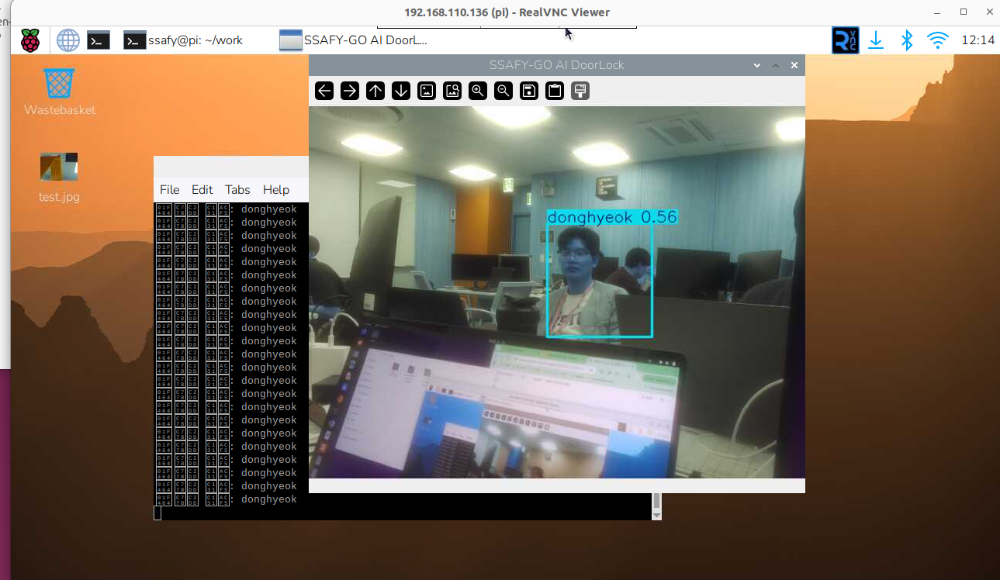
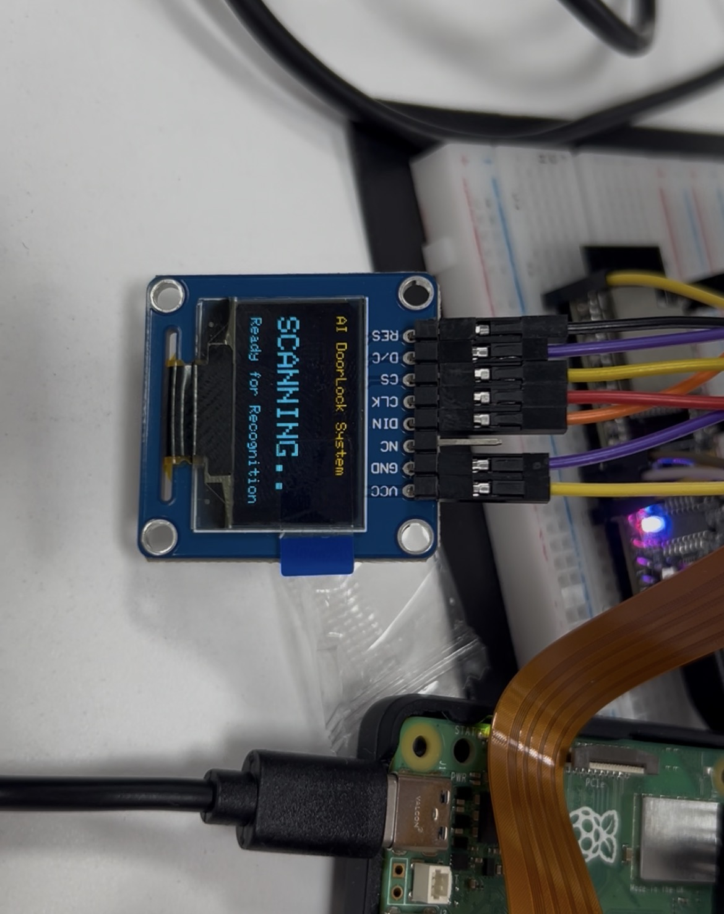
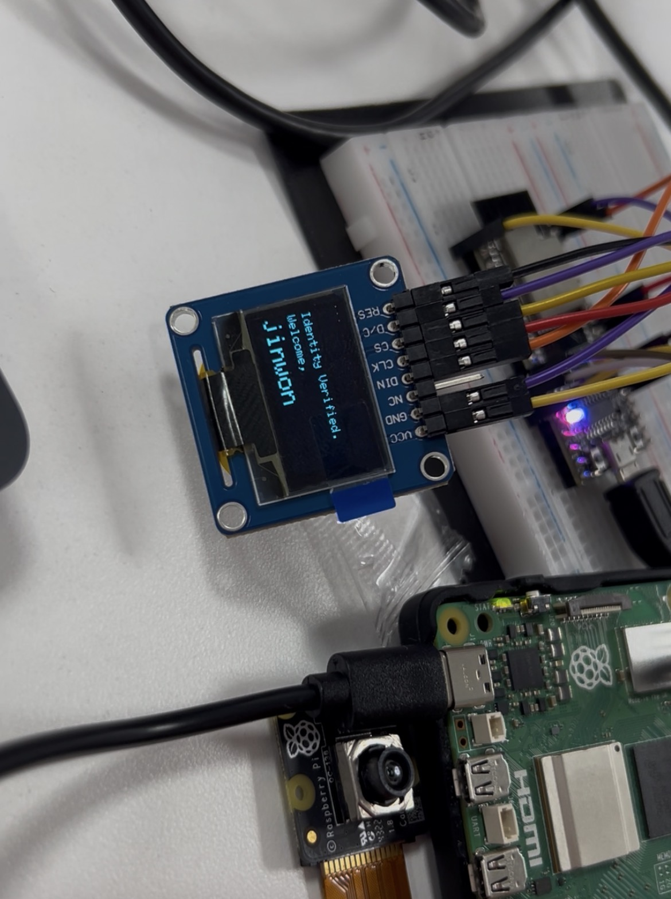

# SSAFY-GO: AI Smart DoorLock System

## 프로젝트 소개
라즈베리 파이 5(Raspberry Pi 5)와 ESP32를 Serial 통신으로 연결하여 구현한 AI 안면 인식 스마트 도어락 시스템입니다. 
사전에 학습된 사용자(SSAFY 교육생)의 얼굴을 실시간으로 탐지하고, 인가된 사용자일 경우 ESP32로 데이터를 전송하여 OLED 디스플레이 출력 및 도어락(모터)을 제어합니다.

### 시연 화면
| 실시간 AI 객체 탐지 (VNC) | 도어락 대기 화면 (OLED) | 도어락 인식 화면 (OLED) |
|:---:|:---:|:---:|
|  |  |  |

 

## 시스템 아키텍처 (System Architecture)

1. Vision Node (Raspberry Pi 5 + IMX708 NoIR)
   - YOLOv8을 활용한 실시간 안면 인식 및 분류 (Custom Dataset 학습)
   - OpenCV를 이용한 프레임 최적화 및 BGR 색상 교정
   - 인가된 사용자 탐지 시 UART Serial(/dev/ttyAMA0)로 데이터 전송

2. Control Node (ESP32)
   - 라즈베리 파이로부터 UART 시리얼 데이터 수신 (RX2, TX2)
   - 수신된 데이터 파싱 후 Adafruit_SSD1306 라이브러리로 OLED 상태 업데이트
   - (확장) 모터 제어를 통한 도어락 개폐 로직 수행

 

## 폴더 구조 (Directory Structure)

    FaceDetect_Raspi5_ESP32/
    ├── docs/                      # README 및 포트폴리오용 이미지 에셋
    ├── esp32_controller/          # ESP32 제어부 소스 코드
    │   └── esp32_controller.ino   # OLED 디스플레이 및 시리얼 수신 로직
    ├── scripts/                   # 개발 자동화 스크립트
    │   └── auto_label.py          # 대량의 데이터셋 자동 라벨링 스크립트
    ├── best.pt                    # YOLOv8 Custom Face Detection 가중치 파일
    ├── data.yaml                  # 데이터셋 설정 파일
    └── detect_face.py             # 라즈베리 파이 메인 실행 스크립트 (추론 및 송신)

 

## 실행 방법 (Getting Started)

### 1. Raspberry Pi 5 (AI Inference)

    # 필수 라이브러리 설치
    pip install ultralytics opencv-python pyserial picamera2

    # 실행 (VNC 환경 권장)
    python3 detect_face.py

### 2. ESP32 (Hardware Control)
- Arduino IDE에서 ESP32 Dev Module 선택
- 필수 라이브러리 설치: Adafruit GFX, Adafruit SSD1306
- 하드웨어 연결:
  - RPi TX (GPIO 14) -> ESP32 RX2 (GPIO 16)
  - RPi RX (GPIO 15) -> ESP32 TX2 (GPIO 17)
  - RPi GND -> ESP32 GND (전위차 동기화 필수)
- esp32_controller.ino 업로드

 

## 트러블 슈팅 (Trouble Shooting)
* Serial 통신 데이터 누락: 파이썬 encode()와 ESP32 readStringUntil('\n')을 조합하여 패킷 끝단(Line Feed)을 명확히 구분, 통신 안정성 확보.